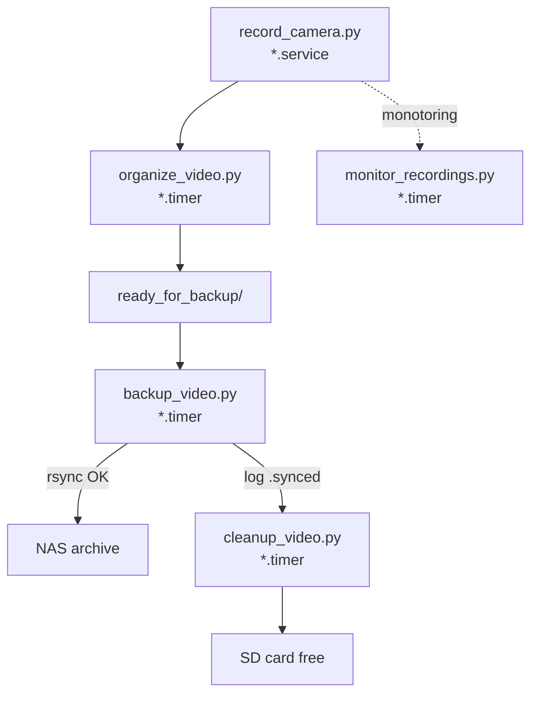

# Notes during the recording season
- 20250528T153000: recording stopped at May 23 03:30, probable cause: camera stopped sending data and ffmpeg process hanged forever waiting without restart
- 20250528T153002: noticed at May 28 12:00, restarted before lunch, then patched and restarted during the afternoon until 15:27. Will be gaps in data during this day.
- 20250528T153005: Should record audio nicely again from May 28 15:27, and notice if this happens again and restart automatically using new monitor_recordings.service
  - ffmpeg should die if no data comes from camera during 30 seconds => camera service restarting the ffmpeg process
  - if no recordings are in the recording_dir or the last one is older than segment_time * 2 minutes, then the monitor_recording.service will try to restart the camera recording
- 20250528T153800: Had to restart all record_camera*.service, because of change to the log level from "info" to "warning" because the -report flag made ffmpeg create too large logs. Should now be smaller.
- 20250528T153800: Should have continuous .mkv recordings again from May 28 at 15:40, so gap between 20250523T033000 to 20250528T154000
- 20250529T074400: The log lavel change did not take, restarted all recordings around this time may have lost a bit here

# 📹 AukLab Video Recording Pipeline — Documentation

This single-node pipeline continuously records RTSP streams from multiple cameras, stores them in time-stamped 10-minute segments, archives the footage to a NAS, and keeps the SD card tidy. Everything is orchestrated by **systemd** units that are generated for you.&#x20;

> **Quick start**:
>
> 1. Put your camera + NAS credentials in `cameras.json` and `backup.json`.
> 2. `python3 service_helper.py generate`  → creates unit/timer files under `services/` and `timers/`.
> 3. `sudo python3 service_helper.py link start enable`  → symlinks them into `/etc/systemd/system`, starts them, and enables auto-start at boot.

---

## 1. Repository Layout

```text
.
├── backup_video.py          ← Rsync segments to NAS
├── cleanup_video.py         ← Delete segments that are already on NAS
├── monitor_recordings.py    ← Watch-dog: restart stalled recorders
├── organize_video.py        ← Move finished segments into date folders
├── record_camera.py         ← Spawn one FFmpeg process per camera
├── service_helper.py        ← Generate & manage all *.service / *.timer files
├── cameras.json             ← Per-camera settings + fleet-wide defaults
├── backup.json              ← NAS target & housekeeping paths
├── services/                ← Auto-generated .service units
└── timers/                  ← Auto-generated .timer units
```

Each script is a thin, single-purpose command-line tool so you can run it manually **or** through its matching systemd unit.&#x20;

---

## 2. Configuration Files

### `cameras.json`

```jsonc
{
  "defaults": {
    "user":        "viewer",
    "password":    "secret",
    "output_dir":  "/home/recordingpi/cameras",
    "logs_dir":    "/home/recordingpi/logs",
    "segment_time": 600,          // seconds
    "loglevel":     "info",
    "rtsp_port":    554
  },
  "cameras": [
    { "station": "ROST1", "ip": "192.168.1.75" },
    { "station": "ROST2", "ip": "192.168.1.76" }
  ]
}
```

* **defaults** — inherited by every camera unless overridden.
* **cameras\[]** — one entry per physical device. Only `station` (code name) and `ip` are mandatory.

### `backup.json`

```jsonc
{
  "ready_for_backup_dir": "/home/recordingpi/ready_for_backup",
  "nas_target_dir":       "/mnt/nas/video_archive",
  "success_log_dir":      "/home/recordingpi/backup_logs",
  "lock_dir":             "/home/recordingpi/locks",
  "rsync_options": [
    "-avh", "--partial", "--progress", "--chmod=ug+rwX"
  ]
}
```

*Edit the paths to match your NAS mount point and local disk layout.*

---

## 3. Script Reference

| Script                      | Purpose                                                                                                                                                                                                     | Key CLI options                                                                                      | Reads / Writes                                            |
| --------------------------- | ----------------------------------------------------------------------------------------------------------------------------------------------------------------------------------------------------------- | ---------------------------------------------------------------------------------------------------- | --------------------------------------------------------- |
| **`record_camera.py`**      | Launches **one FFmpeg** per camera that writes rolling MKV segments (`STATION_YYYYMMDDTHHMMSS.mkv`). Intended to run **forever** under systemd.                                                             | `--ip`, `--station`, `--user`, `--password`, `--segment_time`, `--output_dir`, `--core` (pin to CPU) | Writes segments into `output_dir/STATION/`.               |
| **`organize_video.py`**     | Moves *completed* segments (older than **2 × segment\_time**) from the live output dir into `ready_for_backup/STATION/YYYY-MM-DD/`.                                                                         | `--backup_config`, `--cameras_config`                                                                | Reads `cameras.json`, moves files, creates date folders.  |
| **`backup_video.py`**       | Rsyncs everything in `ready_for_backup` that is **not yet listed** in the current day’s `.synced` log to the NAS. Adds a simple file lock to avoid overlapping runs.                                        | `--backup_config`                                                                                    | Reads & appends to `success_log_dir/YYYY-MM-DD.synced`.   |
| **`cleanup_video.py`**      | Deletes local segments that already appear in any `*.synced` log, then prunes empty directories. Run **after** backup.                                                                                      | `--backup_config`                                                                                    | Reads `.synced` logs, unlinks local files.                |
| **`monitor_recordings.py`** | Every 5 min: checks the newest `.mkv` in each `STATION/` dir. If no new file landed within `segment_time × multiplier` seconds (default = 20 min), it restarts the corresponding `record_camera_*.service`. | `--recording_dir`, `--segment_time`, `--multiplier`                                                  | Calls `systemctl restart …`.                              |
| **`service_helper.py`**     | Autogenerates all \*.service / \*.timer files **locally**, optional symlink into `/etc/systemd/system`, and can bulk-start/enable them.                                                                     | `generate`, `link`, `start`, `stop`, `enable`, `disable`, `status`                                   | Writes to `services/`, `timers/`, invokes `systemctl`.    |

---

## 4. Generated systemd units

For *each camera* the helper creates:

```ini
# services/record_camera_ROST2.service
[Unit]
Description=Record camera ROST2
After=network-online.target
...
[Service]
ExecStart=/usr/bin/python3 /repo/record_camera.py \
          --ip 192.168.1.76 --station ROST2 --user viewer --password secret ...
Restart=always
```

Auxiliary one-shot jobs and their timers:

| Job                      | Timer interval   | Reason                 |
| ------------------------ | ---------------- | ---------------------- |
| `organize_video.service` | every **10 min** | Keep `output_dir` neat |
| `backup_video.service`   | every **10 min** | Push footage to NAS    |
| `cleanup_video.service`  | every **10 min** | Free SD-card space     |

The timers are intentionally staggered (2 min apart) to avoid disk contention.&#x20;

A watchdog pair (`monitor_recordings.service` + `.timer`) restarts crashed or frozen recorders every 5 min.

---

## 5. End-to-end Flow



1. **Record** → 2. **Organize** → 3. **Backup** → 4. **Cleanup**
   If step 3 fails (network down, NAS offline) nothing is deleted; cleanup only removes files that *successfully* reached the NAS.&#x20;

---

## 6. Installation & Operation

```bash
# 1. Clone & edit configs
git clone git@github.com:your-org/auklab-video.git
cd auklab-video
vim cameras.json backup.json

# 2. Generate & inspect units
python3 service_helper.py generate
tree services timers | head

# 3. Link into systemd and start
sudo python3 service_helper.py link start enable

# 4. Check status
sudo python3 service_helper.py status
journalctl -u record_camera_ROST2.service -f
```

*Upgrades*: Pull new commits, re-run `generate` then `link` (it will overwrite units in place). Timers keep running.

---

## 7. Troubleshooting

| Symptom                          | Check                                   | Fix                                           |
| -------------------------------- | --------------------------------------- | --------------------------------------------- |
| **No new files in `output_dir`** | `journalctl -u record_camera_*.service` | Wrong RTSP creds / IP; camera offline         |
| **Disk fills up**                | `du -sh /home/recordingpi/cameras`      | Verify `cleanup_video.timer` is active        |
| **NAS sync never ends**          | `journalctl -u backup_video.service`    | Network lag; tweak `rsync_options`            |
| **Recorder restarts frequently** | FFmpeg `*.log` files in `logs_dir`      | Increase `segment_time` or investigate camera |

---

## 8. Customisation Tips

* **Segment length** — set `segment_time` once in `cameras.json → defaults`; all scripts derive their timing from it.
* **CPU affinity** — `record_camera.py --core N` keeps one FFmpeg per core; the helper rotates through cores automatically.
* **More cameras** — append new `{ "station": "...", "ip": "..." }` entries, rerun `service_helper.py generate`.
* **Different archive root** — change `nas_target_dir` in `backup.json`; no code changes needed.

---

## 9. Version control

Commit the **generated** unit files (`services/`, `timers/`) if you want full reproducibility, or add them to `.gitignore` to keep the repo clean. Either way, the generator is deterministic.&#x20;

---

## 10. E-mail alerts
Credentials live in /etc/monitor_email.conf (chmod 600). Example:

```
SMTP_HOST=smtp.gmail.com
SMTP_PORT=587
SMTP_USER=aukLab2025@gmail.com
SMTP_PASS=<16-char Gmail App Password>
ALERT_TO=john@example.com,alice@example.com
```

monitor_recordings.service loads them via

```
EnvironmentFile=/etc/monitor_email.conf.
```

Every auto-restart triggers one mail:

```
Subject: [CAMERA] Auto-restart ROST2
Body:    ROST2 idle for 1223 s → restarting record_camera_ROST2.service
         Host: morus-vm  |  Time: 2025-05-28 15:20:10
```
